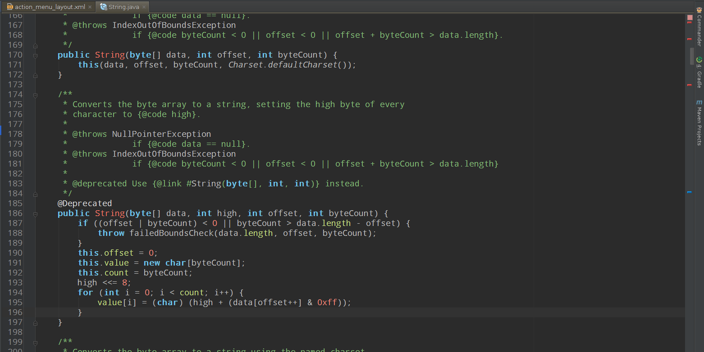
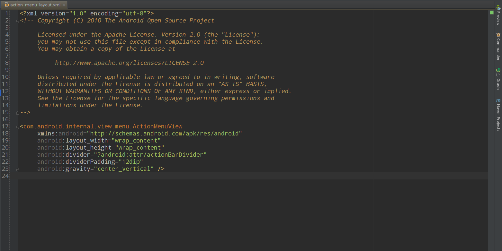

# ToRo Color scheme 
For Android Studio and Intellij IDEA.

Configured for Java and XML (Android development).

## Screenshot
* Java

* XML

## Install
* ln -s ToRo.icls ~/.AndroidStudioPreview/config/colors/
* ln -s ToRo.icls ~/.IdeaIC13/config/colors/

## Set as default
Settings -> Editor -> Colors & Font -> Choose "ToRo" -> OK
